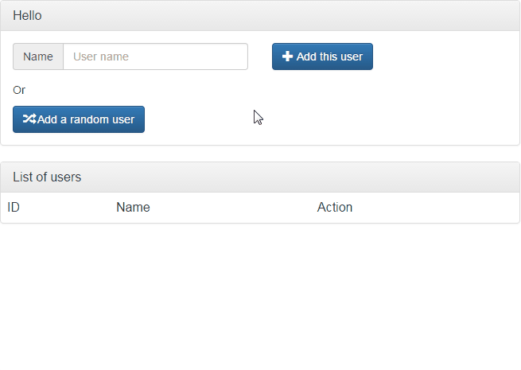
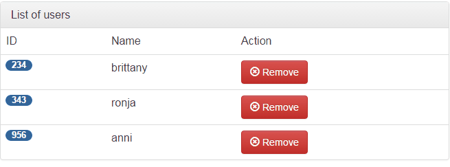
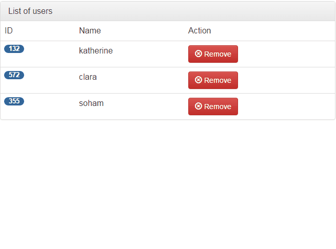
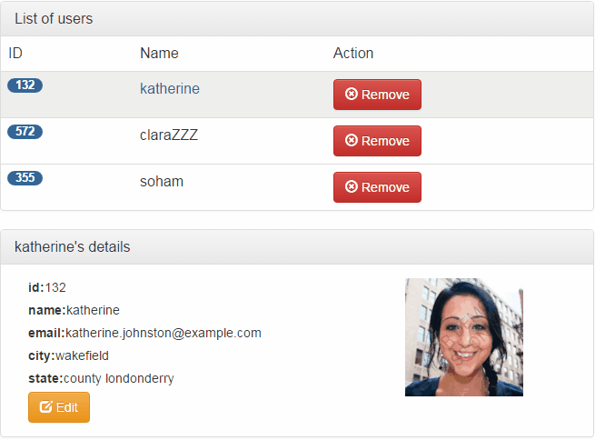

## Tutorial/Tutoriel

Let's create a small CRM app that allows us to create, read, update, delete users. **[Click here for a live example!](http://plnkr.co/edit/bfvDCLlDSue6LVuVvBRp?p=preview)**<br/>

Je vous propose de créer une petite application de type CRM qui fait du CRUD. **[Cliquez ici pour lancer l'app sous Plunker!](http://plnkr.co/edit/bfvDCLlDSue6LVuVvBRp?p=preview)**

## Index
<!-- TOC depthFrom:2 depthTo:3 withLinks:1 updateOnSave:0 orderedList:0 -->

- [1. Let's begin / Pour commencer](#1-lets-begin--pour-commencer)
	- [1.1 Configuraton](#11-configuraton)
	- [1.2 First files / Les premiers fichiers](#12-first-files--les-premiers-fichiers)
- [2. Navbar / Barre de navigation](#2-navbar--barre-de-navigation)
	- [2.1 Router configuration / Configuration des routes](#21-router-configuration--configuration-des-routes)
	- [2.2 Home and Removed components / Composants Home et Removed](#22-home-and-removed-components--composants-home-et-removed)
- [3. Form](#3-form)
	- [3.1 Data binding](#31-data-binding)
	- [3.2 Dependency injection / Injection de dépendance](#32-dependency-injection--injection-de-dependance)
	- [3.3 Updating files / Mise a jour des fichiers](#33-updating-files--mise-a-jour-des-fichiers)
- [4. Users list / Liste d'utilisateurs](#4-users-list--liste-dutilisateurs)
	- [4.1 ngFor directive](#41-ngfor-directive)
	- [4.2 Remove users / Supprimer des utilisateurs](#42-remove-users--supprimer-des-utilisateurs)
- [5. Users details / Details d'utilisateur](#5-users-details--details-dutilisateur)
	- [5.1 Display details / Afficher les details](#51-display-details--afficher-les-details)
	- [5.2 Edit details / Modifier les details](#52-edit-details--modifier-les-details)
- [6. Removed users / Utilisateurs supprimes](#6-removed-users--utilisateurs-supprimes)
	- [6.1 Display removed users / Afficher les utilisateurs supprimes](#61-display-removed-users--afficher-les-utilisateurs-supprimes)
	- [6.2 Restore / Restaurer](#62-restore--restaurer)
- [A. Clone the app / Cloner l'app](#a-clone-the-app--cloner-lapp)

<!-- /TOC -->

## 1. Let's begin / Pour commencer

### 1.1 Configuraton
- Install node.js  https://nodejs.org/en/download/
- Create a new folder
- Copy **[package.json](package.json)**
- Copy **[tsconfig.json](tsconfig.json)**
- Do npm install (will install the dependencies)


### 1.2 First files / Les premiers fichiers

First we'll create a file named app.component.ts. The application should have the following structure:</br>

D'abord, nous allons créer un fichier app.component.ts. L'application aura la structure suivante:

app/</br>
----/boot.ts</br>
----/app.component.ts</br>
index.html

**app.component.ts**
```javascript
import {Component} from 'angular2/core';

@Component({
  selector: 'my-app',
  template:`<h2>{{title}}</h2>`
})
export class AppComponent {
  public title;
  constructor(){
    this.title = 'Angular 2 example by Johann';
  }
}
```
<br/>
Then we'll create the following file.</br>

Ensuite créez le fichier suivant.</br></br>
**index.html**

```html
<html>
  <head>
    <title>Users Tutorial</title>
    <!-- 1. Load libraries -->
    <script src="node_modules/angular2/bundles/angular2-polyfills.js"></script>
    <script src="node_modules/systemjs/dist/system.src.js"></script>
    <script src="node_modules/rxjs/bundles/Rx.js"></script>
    <script src="node_modules/angular2/bundles/angular2.dev.js"></script>
    <script src="//code.jquery.com/jquery-1.11.3.min.js"></script>
    <!-- Latest compiled and minified CSS -->
  <link rel="stylesheet" href="https://maxcdn.bootstrapcdn.com/bootstrap/3.3.6/css/bootstrap.min.css" integrity="sha384-1q8mTJOASx8j1Au+a5WDVnPi2lkFfwwEAa8hDDdjZlpLegxhjVME1fgjWPGmkzs7" crossorigin="anonymous">
  <!-- Optional theme -->
  <link rel="stylesheet" href="https://maxcdn.bootstrapcdn.com/bootstrap/3.3.6/css/bootstrap-theme.min.css" integrity="sha384-fLW2N01lMqjakBkx3l/M9EahuwpSfeNvV63J5ezn3uZzapT0u7EYsXMjQV+0En5r" crossorigin="anonymous">
  <!-- Latest compiled and minified JavaScript -->
  <script src="https://maxcdn.bootstrapcdn.com/bootstrap/3.3.6/js/bootstrap.min.js" integrity="sha384-0mSbJDEHialfmuBBQP6A4Qrprq5OVfW37PRR3j5ELqxss1yVqOtnepnHVP9aJ7xS" crossorigin="anonymous"></script>
    <link href="assets/css/style.css" rel="stylesheet">
    <!-- 2. Configure SystemJS -->
    <script>
      System.config({
        packages: {
          app: {
            format: 'register',
            defaultExtension: 'js'
          }
        }
      });
      System.import('app/boot')
            .then(null, console.error.bind(console));
    </script>
  </head>
<!-- 3. Display the application -->
<body>
  <div class="container">
  <my-app>
    <div class="center-hor-vert">
      <button class="btn btn-lg btn-warning">
        <span class="glyphicon glyphicon-refresh glyphicon-refresh-animate"></span> Loading...</button>
    </div>
  </my-app>
</div>
</body>
</html>
```
<br/>
And we need to boostrap the application with the boot.ts file.</br>

Il faut enfin amorcer l'application via le fichier boot.ts.</br></br>
**boot.ts**
```javascript
import {bootstrap}    from 'angular2/platform/browser'
import {AppComponent} from './app.component'

bootstrap(AppComponent);
```
From within the app folder, try to launch the application with *npm start*, it should work.</br>

Depuis le dossier de l'application, faites *npm start*, l'application devrait se lancer.

## 2. Navbar / Barre de navigation
### 2.1 Router configuration / Configuration des routes
Now, we're gonna add a navbar, to navigate between pages. Create a folder named "shared" that will be used by shared components and services. In that folder create another one named "navbar" then into the latter the file named *navbar.component.ts* and another one named *navbar.template.html*. Just grab the code from the following links:


Nous allons ajouter une barre de navigation pour passer d'une page à l'autre. Créer un dossier "shared" qui sera utilisé pour les composants et services partagés. Dans ce dossier on crée un dossier navbar dans lequel on ajoute les fichiers *navbar.component.ts* et *navbar.template.html*. Récupérer le code depuis les liens suivants:

  **[navbar.component.ts](app/shared/navbar/navbar.component.ts)**<br/>
  **[navbar.template.html](app/shared/navbar/navbar.template.html)**

  app/<br/>
  ----shared/<br/>
  ---------------navbar/<br/>
<br/>
Then modify *app.component.ts* as follows:<br/>

Ensuite modifier *app.component.ts* comme suit:<br/><br/>
**app.component.ts**
```javascript
import {Component} from 'angular2/core';
import {RouteConfig, ROUTER_DIRECTIVES} from 'angular2/router';
import {ListRemoved} from './components/removed/removed.component';
import {HomeComponent} from './components/home/home.component';
import {MyNavBar} from './shared/navbar/navbar.component';

@Component({
  selector: 'my-app',
	template:`<h2>{{title}}</h2>
  <my-navbar></my-navbar>
  <router-outlet></router-outlet>`,
  directives:[MyNavBar, ROUTER_DIRECTIVES]
})
@RouteConfig([
  {path:'/', name: 'Home', component: HomeComponent},
  {path:'/removed', name: 'Removed', component: ListRemoved}
])
export class AppComponent {
  public title;
  constructor(){
    this.title = 'Angular 2 example by Johann';
  }
}
```
<br/>
You should also modify *boot.ts* file. ROUTER_PROVIDERS is a module from the router library, it is used to manage the navigation in the application.<br/>

Il faut aussi modifier le fichier *boot.ts*. ROUTER_PROVIDERS est un module importé depuis la librairie *router*, ce module est utilisé pour permettre de gérer la navigation dans l'application.<br/><br/>
**boot.ts**
```javascript
import {bootstrap}    from 'angular2/platform/browser'
import {ROUTER_PROVIDERS} from 'angular2/router';
import {AppComponent} from './app.component'

bootstrap(AppComponent,[ROUTER_PROVIDERS]);
```
Finally, add the following code in index.html, right after *< head>* ...<br/>

Enfin, il faut ajouter le code suivant au fichier index.html, juste après la balise *< head>* ... <br/><br/>
**index.html**
```html
<base href="/">
```
... and right after *< script src="node_modules/angular2/bundles/angular2.dev.js"></script >*.<br/>

... et juste après *< script src="node_modules/angular2/bundles/angular2.dev.js"></script >*.
```html
<script src="node_modules/angular2/bundles/router.dev.js"></script>
<script src="node_modules/angular2/bundles/http.dev.js"></script>
```
You can copy the whole file from sources:  **[index.html](index.html)**<br/>
Vous pouvez aussi copier le fichier depuis les sources:  **[index.html](index.html)**<br/>

### 2.2 Home and Removed components / Composants Home et Removed
If you try right now to launch the application, you'll get a message error, because the application doesn't know the component Home nor Removed. The structure should be as following:<br/>

Si vous essayez de lancer l'application, vous allez recevoir une erreur, car les composants *Home* et *Removed* ne sont pas encore créés. La structure devrait être comme suit:

app/<br/>
----components<br/>
---------------home/<br/>
---------------------home.component.ts<br/>
---------------removed/<br/>
---------------------removed.component.ts

**home.component.ts**
```javascript
import {Component} from 'angular2/core';

@Component({
	selector: 'my-home',
  template:`<h2>Home Component</h2>`,
  directives: []
})
export class HomeComponent {
  constructor() {
  }
}
```
**removed.component.ts**
```javascript
import {Component} from 'angular2/core';

@Component({
	selector: 'removed-list',
  template:`<h2>Removed Component</h2>`,
})
export class ListRemoved {
  constructor(){
  }
}
```

If you launch the app, it should work and you should be able to navigate between these two pages.<br/>

Vous pouvez lancer l'application qui ne devrait plus provoquer d'erreurs, vous pouvez normalement naviguer entre les deux pages créées.

## 3. Form
### 3.1 Data binding

We're gonna create an html form with two ways data binding. This form will consist of a component and a template. It will look like this:<br/>

Nous allons créer un formulaire qui utilise le *two ways data binding*. Le formulaire sera composé d'un composant et d'un template, il ressemblera à ça:<br/>

<br/><br/>
The strucutre will be as follows:<br/>

La structure sera comme suit:<br/>
app/<br/>
----components/<br/>
-----------------form/<br/>
----------------------user-form.component.ts<br/>
----------------------user-form.template.html<br/>

**user-form.component.ts**
```javascript
import {Component} from 'angular2/core';
import {User} from 'app/shared/user/user';

@Component({
  selector: 'my-form',
  templateUrl: 'app/components/form/user-form.template.html'
})
export class MyForm {
  user : User;
    constructor() {
    this.user=new User();
    this.user.name="";
  }
}
```
Grab the code here: <br/>

Récupérez le code ici: <br/>
**[user-form.template.html](app/components/form/user-form.template.html)**
<br/>

For the time being, the two buttons of the view will report an error, we'll fix it later on. For now create the class User in the following folder:</br>

Pour le moment, les deux boutons vont générer une erreur, on réglera ce problème un peu plus tard. Pour l'instant, créez la classe User dans le dossier suivant:</br>
app/<br/>
----shared/<br/>
---------------user/<br/>
---------------------user.ts<br/>
<br/>
**user.ts**
```javascript
export class User {
    constructor(
    public id: number,
    public name: string,
    public email: string,
    public city: string,
    public state: string,
    public picture: string
  ) {}
}
```

In the previous component HomeComponent, we just displayed a text. We now want to display the component MyForm, so we need to modify **home.component.ts**. Import the module *user-form.component*...<br/>

Dans le composant HomeComponent précédemment créé, nous affichions un simple texte. Nous voulons maintenant afficher le composant MyForm. Nous devons modifier **home.component.ts**, d'abord, on importe le module *user-form.component*...
```javascript
import {MyForm} from 'app/components/form/user-form.component';
```
... and to instantiate the template user-form we need also to add it in the template and as a directive.<br/>

... et pour instancier le template user-form, on ajoute le sélecteur associé à MyForm comme template puis on l'ajoute en tant que directive.
```javascript
template:`<my-form></my-form>`,
directives: [MyForm]
```

So **home.component.ts** should be as follows:
```javascript
import {Component} from 'angular2/core';
import {MyForm} from 'app/components/form/user-form.component';

@Component({
	selector: 'my-home',
  template:`<my-form></my-form>`,
  directives: [MyForm]
})
export class HomeComponent {
  constructor() {
  }
}

```

</br>
A bit of style? Copy **[style.css](assets/css/style.css)** into *assets/css/*</br>

Vous manquez de style? Copiez **[style.css](assets/css/style.css)** dans *assets/css/*</br>

Launch the application and you should be able to use two ways data binding. In **user-form.template.html** the following directive is responsible of data binding. It uses the property of the module declared in MyForm class i.e. user.<br/>

Lancez l'application, vous devriez pouvoir utiliser le data binding dans les deux sens. Dans le template **user-form.template.html**, la directive ci-dessous gère le data binding. Elle utilise la propriété user de la classe MyForm.
```html
<input [(ngModel)]="user.name">
```

### 3.2 Dependency injection / Injection de dependance
We'll now add functionalities to those buttons:
- add a user by name
- add a random user from the api: https://randomuser.me/api/
In **user-form.component.ts**, add the imports:


Maintenant, nous allons implémenter les fonctionnalités associées aux deux boutons précédents:
- ajout d'un utilisateur par nom
- ajout d'un utilisateur via l'api: https://randomuser.me/api/
Dans **user-form.component.ts**, ajoutez les imports:

```javascript
import {UserManager} from 'app/shared/user/user-manager';
import {MyRandom} from 'app/shared/user/user-random';
```
and change the MyForm class by the following:<br/>

remplacez la classe MyForm par le code suivant:
```javascript
export class MyForm {
  user : User;
    constructor(public um: UserManager, public ur: MyRandom) {
    this.user=new User();
    this.user.name="";
  }
  add(user) {
    this.um.add(user);
  }
  addRandom() {
    this.ur.getRandom().then((user) => {
      this.um.addRandom(user);
    });
  }
}
```

As you can see above, we used in the constructor two parameters of type UserManager and MyRandom. Those services are injected by Angular. We have to follow two steps:
- Creating those two classes
- Adding them to the bootstrapping process


Comme vous pouvez le voir dans ce code, nous utilisons deux paramètres dans le constructeur qui sont respectivement de type UserManager et MyRandom. Ces deux services sont injectés par Angular. Nous devons suivre deux étapes pour faire fonctionner l'injection de dépendance:
- Créer ces deux services
- Les ajouter au processus de bootstrapping

In the following folder, add the file **[user-manager.ts](app/shared/user/user-manager.ts)** and **[user-random.ts](app/shared/user/user-random.ts)**. User-manager is the service that will mostly do CRUD operation on the user in your application. User-random will get random users from the API https://randomuser.me and will add them to your application.<br/>

Dans le dossier suivant, ajouter les fichiers **[user-manager.ts](app/shared/user/user-manager.ts)** et **[user-random.ts](app/shared/user/user-random.ts)**. User-manager est le service qui permettra de réaliser des opérations de types CRUD sur les utilisateurs de l'application. Quant à user-random, il fait appel à l'API de https://randomuser.me et permet d'ajouter des utilisateurs de façon aléatoire.<br/>


app/<br/>
----shared/<br/>
---------------user/<br/>
---------------------user-manager.ts<br/>
---------------------user-random.ts<br/>

### 3.3 Updating files / Mise a jour des fichiers

You should also modify *boot.ts* as follows or copy the file: **[boot.ts](app/boot.ts)**<br/>

Il faut aussi modifier le fichier *boot.ts* comme suit ou le copier depuis: **[boot.ts](app/boot.ts)**<br/><br/>
**boot.ts**
```javascript
import {bootstrap}    from 'angular2/platform/browser'
import {ROUTER_PROVIDERS} from 'angular2/router';
import {AppComponent} from './app.component'
import {UserManager} from './shared/user/user-manager';
import {MyRandom} from './shared/user/user-random';
import {HTTP_PROVIDERS} from 'angular2/http';

bootstrap(AppComponent,[UserManager, MyRandom, ROUTER_PROVIDERS, HTTP_PROVIDERS]);
```

You won't get error anymore if you press the button in the form.<br/>

Vous ne devriez plus avoir d'erreurs en appuyant sur les boutons du formulaire.<br/>

## 4. Users list / Liste d'utilisateurs
### 4.1 ngFor directive
In this chapter we'll display list of every user in the application with ngFor directive. This directive will instantiate a template for each item in a list. <br/>

Dans ce chapitre nous allons afficher la liste de tous les utilisateurs de l'application avec la directive ngFor. Cette directive instancie le template pour chaque item trouvé dans liste.  <br/>

<br/>

For instance, in the code below, the directive will instantiate a new row for each user in users.<br/>
Dans l'exemple ci-dessous, cette directive va instancier une nouvelle ligne du tableau pour chaque user dans users.<br/>
```javascript
<tr *ngFor="#user of users">
  <td>{{user.id}}</td>
  <td>{{user.name}}</td>
</tr>
```

In order to display every user in our application, copy the file **[user-list.template.html](app/components/list/user-list.template.html)** in the folder below:<br/>

Afin d'afficher les utilisateurs de notre application, copiez le fichier **[user-list.template.html](app/components/list/user-list.template.html)** suivant dans le dossier ci-dessous: <br/>

app/<br/>
----components/<br/>
-----------------list/<br/>
----------------------user-list.component.ts<br/>
----------------------user-list.template.html<br/>


**user-list.component.ts**<br/>
```javascript
import {Component} from 'angular2/core';
import {User} from 'app/shared/user/user';
import {UserManager} from 'app/shared/user/user-manager';

@Component({
  selector: 'user-list',
  templateUrl:"app/components/list/user-list.template.html"
})
export class ListComponent {
  public users:User[];
  constructor(public um: UserManager){
    this.users = um.users;
  }
}
```

In the previous component HomeComponent, we just displayed MyForm component. We now want to display the component ListComponent, so we need to modify **home.component.ts**. Import the module *user-list.component*...<br/>

Dans le composant HomeComponent précédemment créé, nous affichions uniquement le formulaire. Nous voulons maintenant afficher le composant ListComponent. Nous devons modifier **home.component.ts**, d'abord, on importe le module *user-list.component*...
```javascript
import {ListComponent} from 'app/components/list/user-list.component';
```
... and to instantiate the template user-form we need also to add it in the template and as a directive.<br/>

... et pour instancier le template user-form, on ajoute le sélecteur associé à MyForm comme template puis on l'ajoute en tant que directive.
```javascript
template:`<my-form></my-form>
<user-list></user-list>`,
directives: [MyForm, ListComponent]
```

So **home.component.ts** should be as follows:
```javascript
import {Component} from 'angular2/core';
import {MyForm} from '../form/user-form.component';
import {ListComponent} from 'app/components/list/user-list.component';

@Component({
	selector: 'my-home',
  template:`<my-form></my-form>
  <user-list></user-list>`,
  directives: [MyForm, ListComponent]
})
export class HomeComponent {
  constructor() {
  }
}
```


Replace boot.ts by the following: <br/>

Remplacez boot.ts par le fichier suivant:<br/>
**[boot.ts](app/boot.ts)**<br/>

In this list, when you click on a user, or on remove, you should get an error let's fix this.<br/>

Dans la liste, si vous cliquez sur un utilisateur ou sur Remove, vous devriez voir un erreur, résolvons ça.

### 4.2 Remove users / Supprimer des utilisateurs
We should be able to remove users. Those removed users won't be lost forever, they will be put in a bin. From it, we can restore them.<br/>

Il est possible de supprimer des utilisateurs. Ces utilisateurs supprimés seront mis dans une corbeille. Depuis celle-ci, il sera possible de les restaurer.

<br/>

Just add the following methods to the *ListComponent* component. It will enable user selection and the remove button.<br/>

Ajoutez les méthodes suivantes au composant *ListComponent*. Elles activeront la sélection d'un utilisateur et le bouton remove.

**user-list.component.ts**<br/>
```javascript
onSelect(user: User) {
  this.selectedUser = user;
}
remove(user) {
  if (this.selectedUser === user) {
    this.selectedUser = false;
  }
  this.um.remove(user);
  return false;
}
```

And of course, do not forget to set selectedUser as an property of the class ListComponent. <br/>

Bien entendu, n'oubliez pas de spécifier selectedUser en tant que propriété de la classe ListComponent.
```javascript
  public selectedUser:User;
```

So, it should look like this:<br/>

Ce fichier doit ressembler à ça:<br/><br/>
**user-list.component.ts**
```javascript
import {Component} from 'angular2/core';
import {User} from 'app/shared/user/user';
import {UserManager} from 'app/shared/user/user-manager';

@Component({
  selector: 'user-list',
  templateUrl:"app/components/list/user-list.template.html"
})
export class ListComponent {
  public users:User[];
  public selectedUser:User;
  constructor(public um: UserManager){
    this.users = um.users;
  }
  onSelect(user: User) {
  this.selectedUser = user;
}
remove(user) {
  if (this.selectedUser === user) {
    this.selectedUser = false;
  }
  this.um.remove(user);
  return false;
}
}

```

## 5. Users details / Details d'utilisateur
### 5.1 Display details / Afficher les details
In the users list, if you click on one of them, it displays its details. <br/>

Si vous cliquez sur un utilisateur de la liste, ça affichera ses détails. <br/>
<br/><br/>

We'll create a new component and its template, **user-detail.component.ts** and **user-detail.template.html** in the folder: <br/>

Nous allons créer un nouveau composant et son template, **user-detail.component.ts** et **user-detail.template.html** dans le dossier: <br/>

app/<br/>
----components/<br/>
-----------------details/<br/>
----------------------user-detail.component.ts<br/>
----------------------user-detail.template.html<br/><br/>
**user-detail.component.ts**<br/>
```javascript
import {Component,Input} from 'angular2/core';
import {User} from '../../shared/user/user';
import {UserManager} from 'app/shared/user/user-manager';
@Component({
  selector: 'my-user-detail',
  templateUrl:'app/components/details/user-detail.template.html'
})
export class UserDetailComponent {
  @Input('my-user') user:string;
  constructor(public um:UserManager){
}
}
```
@Input is a data bound input property. It is bound to the property selectedUser of the user-list component. It allows us to pass data between components. Remember, at the end of the template **user-list.template.html** there was:<br/>

@Input est une propriété permettant de passer des paramètres entre composants. A la fin du template **user-list.template.html**, il y avait la déclaration suivante:
```html
<my-user-detail [my-user]="selectedUser"></my-user-detail>
```
The property selectedUser of the component *ListComponent* is passed to the property user of the component  *UserDetailComponent* (**user-detail.component.ts**), see below.<br/>

La propriété selectedUser de la composant *ListComponent* est passé vers la propriété user du composant *UserDetailComponent* (**user-detail.component.ts**) ci-dessous.<br/>

```javascript
@Input('my-user') user:string;
```

**user-detail.template.html**
```html
<div *ngIf="user">
  <div class="panel panel-default">
    <div class="panel-heading">
      <h3 class="panel-title">{{user.name}}'s details</h3>
    </div>
    <div class="panel-body">
      <div *ngIf=!editing class="col-xs-8">
        <div>
          <label>id: </label>{{user.id}}
        </div>
        <div>
          <label>name: </label>{{user.name}}
        </div>
        <div>
          <label>email: </label>{{user.email}}
        </div>
        <div>
          <label>city: </label>{{user.city}}
        </div>
        <div>
          <label>state: </label>{{user.state}}
        </div>
        <button (click)="edit()" type="button" class="btn btn-warning">
          <span class=" glyphicon glyphicon-edit"></span> Edit </button>
      </div>
      <div class="col-xs-4">
        
      </div>
    </div>
  </div>
</div>
```
We have to modify **user-list.component.ts**. Import the details component...<br/>

Il faut modifier **user-list.component.ts**. Importez le composant details...<br/><br/>
**user-list.component.ts**<br/>
```javascript
import {UserDetailComponent} from 'app/components/details/user-detail.component';
```
...and in the component configuration right under templateUrl, add the directive to display the details component<br/>

...et dans la configuration du composant, juste en dessous de templateUrl, ajoutez la directive pour afficher le composant "details".<br/>
```javascript
  directives: [UserDetailComponent]
```

So **user-list.component.ts** should look like:  **[user-list.component.ts](app/components/list/user-list.component.ts)**. Let's try the app, it should work.<br/>

Après modification, **user-list.component.ts** devrait ressembler à:
**[user-list.component.ts](app/components/list/user-list.component.ts)**. Vous pouvez essayer l'application, elle devrait fonctionner.<br/>

### 5.2 Edit details / Modifier les details
Now, we want to be able to edit users' details from the same view.<br/>

Nous voulons pouvoir éditer les détails des utilisateurs depuis la même vue.<br/>
<br/><br/>
We'll modify the component *UserDetailComponent* and its template, use the following files :  **[user-detail.component.ts](app/components/details/user-detail.component.ts)** and **[user-detail.template.html](app/components/details/user-detail.template.html)**.<br/>

Nous allons modifier le composant *UserDetailComponent* et son template, utilisez les fichiers suivants: **[user-detail.component.ts](app/components/details/user-detail.component.ts)** et **[user-detail.template.html](app/components/details/user-detail.template.html)**.<br/>

## 6. Removed users / Utilisateurs supprimes

### 6.1 Display removed users / Afficher les utilisateurs supprimes
The removed users are moved into the bin which is accessible on the page *Removed* on the navbar. First, we'll display the removed users on that page. Modify the file **removed.component.ts** and create **[removed.template.html](app/components/removed/removed.template.html)** into the following folder:<br/>

Les utilisateurs supprimés sont déplacés dans la corbeille qui est accessible à la page *Removed* depuis la barre de navigation. Dans un premier temps, nous afficherons les utilisateurs supprimés sur cette page. Modifiez le fichier **removed.component.ts** et créer **[removed.template.html](app/components/removed/removed.template.html)** dans le dossier suivant:<br/>
app/<br/>
----components/<br/>
-----------------removed/<br/>
----------------------removed.component.ts<br/>
----------------------removed.template.html<br/><br/>

**removed.component.ts**
```javascript
import {Component} from 'angular2/core';
import {UserManager} from 'app/shared/user/user-manager';
import {User} from 'app/shared/user/user';

@Component({
	selector: 'removed-list',
  templateUrl:"app/components/removed/removed.template.html"
})
export class ListRemoved {
  public users:User[];
  constructor(public um: UserManager){
    this.users = um.removedUsers;
  }
}

```
Give it a try, it should be fine.<br/>

Essayez, ça devrait fonctionner.

### 6.2 Restore / Restaurer
Now we'll add two methods to the buttons in *removed.template.html*. The first one will restore a user, i.e. move a user from the removed list to the actual list. The remove button will definitely remove the user. Add the following code into **removed.component.ts** after the constructor: <br/>

Maintenant nous allons ajouter deux méthodes aux boutons du template *removed.template.html*. Le premier permettra de restaurer un utilisateur effacé, c'est à dire copier de la liste de la corbeille vers la liste courante. Le bouton *remove* effacera définitivement l'utilisateur. Ajoutez le code suivant dans le composant **removed.component.ts**, juste en dessous du constructeur.<br/>
```javascript
restore(user){
    this.um.restore(user);
  }
  remove(user){
    this.um.removeDefinitely(user);
  }
```
The above methods have already been implemented into the service UserManager.<br/>

Les méthodes précédentes ont déjà été implémentées dans le service UserManager.


## A. Clone the app / Cloner l'app
If you don't want to do the tutorial, just follow the following steps:<br/>

Si vous ne souhaitez pas suivre le tutoriel, faites les étapes suivantes:
- install node.js in order to use npm: https://nodejs.org/en/download/
- clone the repository
- cd /folder_of_the_source/
- npm install (install the dependencies)
- npm start (start the server)
